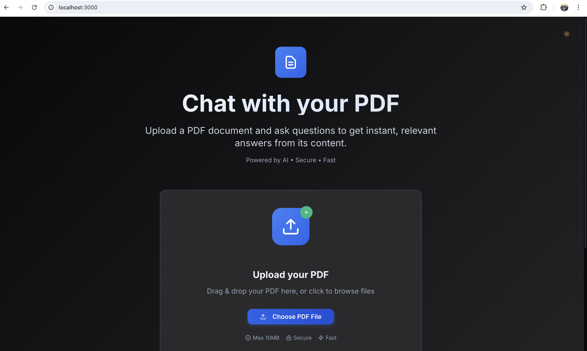
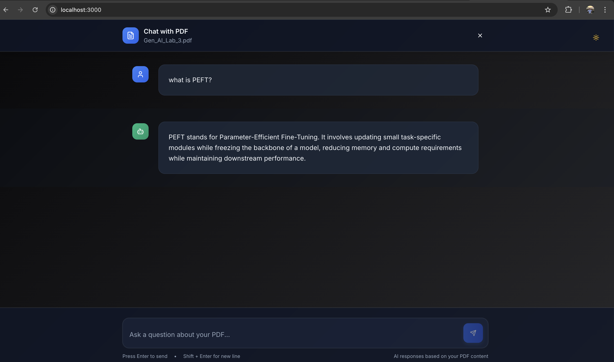
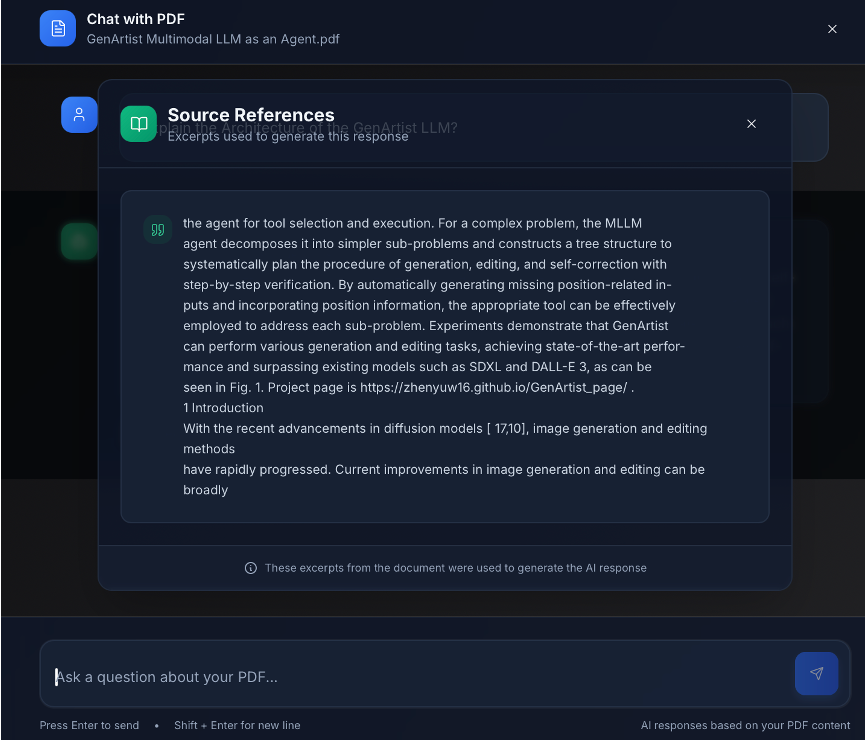
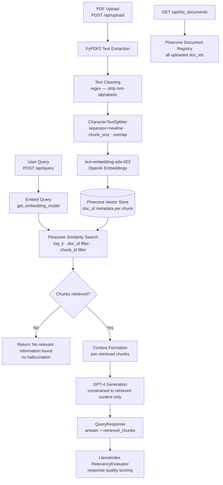

# DocuMind 📄
### Explainable RAG Document Assistant · GPT-4 + Pinecone + FastAPI + React

[](https://python.org)
[](https://fastapi.tiangolo.com)
[](https://reactjs.org)
[](https://pinecone.io)
[](https://openai.com)
[](https://llamaindex.ai)
[](LICENSE)

> **DocuMind** is a production-grade explainable RAG system — upload any PDF, ask natural language questions, and get answers grounded strictly in your document content, with full retrieval transparency, per-document scoped queries, and LlamaIndex-powered response evaluation.

---

## 🎬 Demo

### Home Page


### Citation-Grounded Response


### Trustworthy AI Output


### Explainability & Retrieval Transparency


---

## 🎯 What Makes DocuMind Different from a Basic RAG Chatbot

Most RAG apps do: `question → embed → top-k chunks → generate`

DocuMind does:
```
PDF upload
  → PyPDF2 extraction + regex cleaning
  → CharacterTextSplitter (configurable chunk_size + overlap)
  → text-embedding-ada-002 → Pinecone upsert (with doc_id metadata)
  → per-document scoped query (doc_id + chunk_id filtering)
  → context-constrained GPT-4 prompt (no hallucination beyond retrieved evidence)
  → answer + retrieved_chunks returned together
  → LlamaIndex RelevancyEvaluator scoring (no labeled dataset needed)
```

| Dimension | Basic RAG | DocuMind |
|---|---|---|
| Retrieval scope | Global index — all documents | Per-document scoped via `doc_id` filter |
| Hallucination prevention | None | LLM prompt hard-constrained to retrieved context |
| Empty retrieval handling | Hallucinates or crashes | Returns `"No relevant information found."` explicitly |
| Transparency | Answer only | Answer + retrieved chunks returned together |
| Evaluation | None | LlamaIndex RelevancyEvaluator — no ground truth needed |
| Document management | No | `GET /api/list_documents` — full document registry |

---

## 🏗️ Architecture



### API Surface

| Endpoint | Method | Description |
|---|---|---|
| `/api/upload` | `POST` | Upload PDF → extract → chunk → embed → store in Pinecone |
| `/api/query` | `POST` | Query with optional `doc_id` + `chunk_id` scoping → grounded answer |
| `/api/list_documents` | `GET` | List all documents currently indexed in Pinecone |

---

## 🔬 Worked Example

**Upload:** `financial_report_2024.pdf` → 847 chunks extracted and indexed

**Query:** *"What was the net revenue in Q3?"*

**Pipeline trace:**
```
[Upload]     → PyPDF2 extracts 42 pages → cleaned → split into 847 chunks
             → each chunk embedded via text-embedding-ada-002
             → upserted to Pinecone with doc_id="financial_report_2024.pdf"

[Query]      → "What was the net revenue in Q3?" embedded
             → Pinecone similarity search: top_k=5, doc_id filter active
             → 5 chunks retrieved from financial_report_2024.pdf only

[Prompt]     → "Using the following document content, provide a concise
               and accurate answer... Do not speculate beyond the provided content."
             → GPT-4 constrained strictly to retrieved context

[Response]   → answer: "Q3 net revenue was $4.2B, up 12% YoY per page 18."
             → retrieved_chunks: [chunk_1, chunk_2, ..., chunk_5] returned alongside

[Evaluation] → LlamaIndex RelevancyEvaluator scores response against retrieved context
```

**What happens on a question the document can't answer:**
```
[Query]      → "Who is the CEO of Apple?"
[Retrieval]  → 0 relevant chunks found for doc_id="financial_report_2024.pdf"
[Response]   → "No relevant information found."   ← never hallucinates
```

---

## ⚙️ Engineering Decisions

**Per-document query scoping via Pinecone metadata filtering**
Naively querying a shared Pinecone index returns chunks from all uploaded documents — answers bleed across files. DocuMind stores `doc_id` as metadata on every chunk at upsert time and applies it as a filter on every similarity search. Optional `chunk_id` filtering enables pinpoint retrieval of specific sections. This makes multi-document deployments correct by design rather than an afterthought.

**Hard-constrained prompt to eliminate hallucination**
Standard RAG prompts say "use this context to answer." DocuMind's prompt explicitly says:
```
"If the document does not contain relevant information, state that explicitly.
Do not speculate beyond the provided content."
```
Combined with the graceful empty-retrieval path (`retrieved_chunks == [] → return "No relevant information found."`), the system has two independent hallucination guards — at the retrieval layer and at the generation layer.

**Three-router modular FastAPI architecture**
Upload, query, and document management are split into independent routers (`upload.py`, `query.py`, `list_documents.py`) each registered under `/api`. This means each pipeline stage can be tested, extended, or replaced independently — adding a new embedding model or chunking strategy only touches one module, not the entire backend.

**Configurable CORS with environment-driven origins**
Frontend URL and allowed origins are driven by `config.py` (`ALLOWED_ORIGINS`, `FRONTEND_URL`) rather than hardcoded — the same backend runs in local dev, staging, and production without code changes. `allow_credentials=True` with `allow_methods=["*"]` ensures multipart file uploads work correctly across browsers.

**LlamaIndex evaluation without labeled ground truth**
Standard RAG evaluation requires a labeled QA dataset to measure answer correctness. DocuMind uses LlamaIndex's `RelevancyEvaluator` which measures whether the generated response is consistent with the retrieved context — no labeled dataset required. This makes evaluation practical for any arbitrary PDF without upfront annotation work.

---

## 🔒 Trustworthy AI by Design

DocuMind was built with four explainability principles as first-class requirements:

**Evidence-backed answers** — GPT-4 is prompted to answer only from retrieved chunks. `retrieved_chunks` are returned in the API response alongside the answer so every claim is traceable to a source.

**Retrieval transparency** — The query pipeline surfaces which chunks were retrieved, in what order, and from which document. The user sees the evidence, not just the conclusion.

**Graceful uncertainty** — When retrieval finds nothing relevant, the system says so explicitly rather than generating a plausible-sounding but unsupported answer.

**Scoped context** — Per-document filtering ensures answers are drawn from the correct source document, not contaminated by other uploaded files in the shared index.

---

## 🚀 Quick Start

### Prerequisites
- Python 3.10+
- Node.js 18+
- OpenAI API key
- Pinecone API key (free tier available)

### Backend Setup

```bash
git clone https://github.com/krishnakoushik225/DocuMind
cd DocuMind/backend
pip install -r requirements.txt
```

Create `.env`:
```
OPENAI_API_KEY=your_openai_key
PINECONE_API_KEY=your_pinecone_key
PINECONE_INDEX=documind
FRONTEND_URL=http://localhost:5173
```

Run:
```bash
uvicorn main:app --reload
# API running at http://127.0.0.1:8000
# Docs at http://127.0.0.1:8000/docs
```

### Frontend Setup

```bash
cd ../ui-v1
npm install
npm run dev
# Running at http://localhost:5173
```

---

## 🛠️ Tech Stack

| Layer | Technology | Role |
|---|---|---|
| Frontend | React + Vite | Chat-based document interface |
| Backend | FastAPI (async) | Three-router API: upload / query / documents |
| PDF Processing | PyPDF2 | Structured text extraction from PDFs |
| Text Splitting | LangChain `CharacterTextSplitter` | Configurable chunking with overlap |
| Embedding | OpenAI `text-embedding-ada-002` | Semantic vector representation |
| Vector DB | Pinecone | Similarity search with metadata filtering |
| LLM | OpenAI GPT-4 | Context-constrained answer generation |
| Retrieval | LlamaIndex | Similarity search + RelevancyEvaluator |
| Config | Environment-driven (`config.py`) | CORS origins, chunk params, upload dir |

---

## 📁 Project Structure

```
DocuMind/
├── backend/
│   ├── main.py                    # FastAPI entrypoint — 3 routers, CORS config
│   ├── config.py                  # Env-driven: API keys, chunk_size, overlap, CORS
│   ├── routes/
│   │   ├── upload.py              # POST /api/upload — extract, chunk, embed, store
│   │   ├── query.py               # POST /api/query — retrieve, constrain, generate
│   │   └── list_documents.py      # GET /api/list_documents — Pinecone doc registry
│   ├── services/
│   │   ├── vector_store.py        # Pinecone upsert, similarity search, doc listing
│   │   ├── embedding_service.py   # text-embedding-ada-002 wrapper
│   │   └── llm_service.py         # GPT-4 client wrapper
│   ├── models/
│   │   └── document.py            # QueryRequest, QueryResponse Pydantic models
│   └── requirements.txt
├── ui-v1/
│   ├── src/
│   │   ├── App.jsx                # Chat interface
│   │   └── App.css
│   ├── vite.config.ts
│   └── package.json
├── Home Page.png
├── Sample Query.png
├── Picture1.png
├── Picture2.png
└── README.md
```

---

## 🔭 Roadmap

- [ ] Multi-document cross-reference queries (single question, multiple PDFs)
- [ ] Conversation memory — follow-up questions with session context
- [ ] Streaming token output to frontend in real-time
- [ ] OCR support for scanned PDFs (Tesseract / AWS Textract)
- [ ] Agentic upgrade — multi-hop reasoning across document sections
- [ ] Document comparison mode — diff two PDFs via natural language
- [ ] Export annotated answers as PDF with highlighted source passages
- [ ] Hybrid retrieval — BM25 + semantic search for keyword-dense documents

---

## 📄 License

MIT — free to use and build on.

---

*Built by [Krishna Koushik Unnam](https://github.com/krishnakoushik225)*