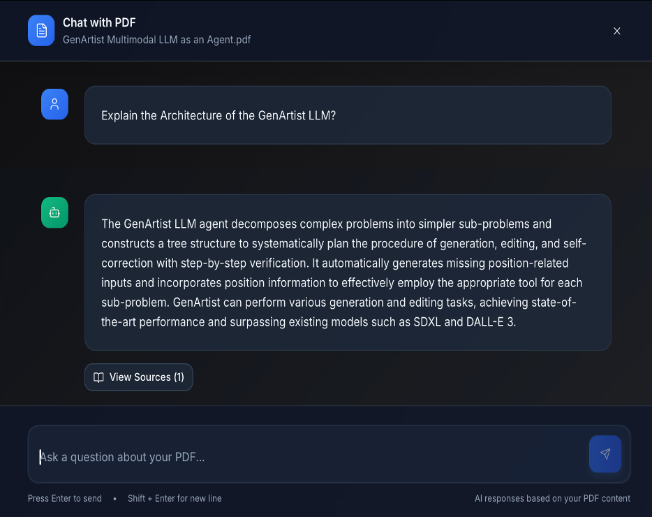

# DocuMind 📄
### AI-Powered Intelligent Document Q&A · RAG + GPT-4 + Pinecone · Citation-Grounded Answers

[](https://python.org)
[](https://fastapi.tiangolo.com)
[](https://reactjs.org)
[](https://pinecone.io)
[](https://openai.com)
[](LICENSE)

> **DocuMind** is a production-grade RAG (Retrieval-Augmented Generation) document assistant. Upload any PDF, ask natural language questions, and get accurate answers grounded strictly in your document content — with inline citations and full transparency into what was retrieved.

---

## 🎬 Demo

### Home Page


### Sample Response


### Trustworthiness & Evidence-Backed Output


### Explainability & Transparency


---

## ✨ What Makes DocuMind Different

| Feature | Basic RAG | DocuMind |
|---------|-----------|----------|
| Retrieval | Naive top-k chunks | Semantic similarity ranking via Pinecone |
| Answers | Raw LLM generation | Strictly grounded in retrieved document context |
| Hallucination Prevention | None | LLM constrained to retrieved context only |
| Evaluation | None | LlamaIndex RelevancyEvaluator — no ground truth needed |
| Transparency | Black box | Retrieved chunks + similarity ranking shown to user |

---

## 🏗️ Architecture

```
┌─────────────────────────────────────────────────────────────┐
│                     INGESTION PIPELINE                       │
│                                                              │
│  PDF Upload → PyPDF2 Extraction → Text Chunking →           │
│  text-embedding-ada-002 → Pinecone Upsert                    │
└──────────────────────────────────────────────────────────────┘
                              │
┌─────────────────────────────▼───────────────────────────────┐
│                      QUERY PIPELINE                          │
│                                                              │
│  User Question → Embed Query → Pinecone Similarity Search →  │
│  Context Formation → GPT-4 Generation →                      │
│  Citation-Grounded Answer + Evidence Snippets                │
└──────────────────────────────────────────────────────────────┘
                              │
┌─────────────────────────────▼───────────────────────────────┐
│                    EVALUATION LAYER                          │
│                                                              │
│  LlamaIndex RelevancyEvaluator → Response Quality Scoring   │
│  (no labeled dataset required)                               │
└──────────────────────────────────────────────────────────────┘
```

### Pipeline Stages

| Stage | Description |
|-------|-------------|
| **PDF Extraction** | PyPDF2 extracts structured text from uploaded PDFs |
| **Text Chunking** | Document split into meaningful, searchable segments |
| **Embedding** | Each chunk embedded via `text-embedding-ada-002` |
| **Pinecone Storage** | Vector embeddings stored for fast semantic retrieval |
| **Query Embedding** | User question embedded and matched against document chunks |
| **Context Formation** | Top-ranked chunks compiled into GPT-4 prompt |
| **GPT-4 Generation** | Answer generated strictly from retrieved context |
| **Evaluation** | LlamaIndex RelevancyEvaluator scores response quality |

---

## 🔒 Trustworthy AI by Design

DocuMind is built around four trustworthy AI principles:

**Evidence-Backed Answers** — The LLM is constrained to answer only from retrieved document chunks. No hallucination, no guessing. Retrieved snippets are shown alongside every answer so users can verify.

**Explainability** — Every response shows which document sections were retrieved, their similarity scores, and how they contributed to the final answer. The full chain from Query → Retrieval → Reasoning → Answer is visible.

**Transparency** — Retrieved chunks, their rankings, and their contribution to the response are all surfaced to the user — not hidden in a black box.

**Hallucination Mitigation** — Ambiguous queries trigger clarification rather than confident incorrect answers. The system never generates beyond its retrieved evidence.

---

## 🚀 Quick Start

### Prerequisites
- Python 3.10+
- Node.js 18+
- OpenAI API key
- Pinecone API key (free tier available)

### 1. Clone the Repository

```bash
git clone https://github.com/krishnakoushik225/DocuMind
cd DocuMind
```

### 2. Backend Setup

```bash
cd backend
pip install -r requirements.txt
```

Create a `.env` file:
```
OPENAI_API_KEY=your_key
PINECONE_API_KEY=your_key
PINECONE_INDEX=documind
```

Run the backend:
```bash
uvicorn main:app --reload
# Runs at http://127.0.0.1:8000
```

### 3. Frontend Setup

```bash
cd ../ui-v1
npm install
npm run dev
# Runs at http://localhost:5173
```

---

## 🎮 Usage

1. **Upload** — drag and drop a PDF via the web interface
2. **Wait** — DocuMind extracts, chunks, embeds, and indexes (~5 seconds)
3. **Ask** — type any natural language question about the document
4. **Read** — get a grounded answer with retrieved evidence snippets and citations

---

## 🛠️ Tech Stack

| Layer | Technology |
|-------|-----------|
| Frontend | React.js (chat-based interface) |
| Backend | FastAPI (Python) |
| PDF Processing | PyPDF2 (structured text extraction) |
| Embedding Model | OpenAI `text-embedding-ada-002` |
| Vector Database | Pinecone |
| LLM | OpenAI GPT-4 |
| Evaluation | LlamaIndex RelevancyEvaluator |

---

## 📁 Project Structure

```
DocuMind/
├── backend/
│   ├── main.py              # FastAPI entrypoint
│   └── requirements.txt
├── ui-v1/
│   ├── src/                 # React frontend
│   ├── package.json
│   └── vite.config.ts
├── Home Page.png            # Screenshots
├── Sample Query.png
├── Picture1.png
├── Picture2.png
└── README.md
```

---

## 📊 Evaluation

Response quality is assessed using **LlamaIndex** without needing pre-labeled datasets:

- **RelevancyEvaluator** — verifies generated responses align with retrieved document sections
- **Contextual relevance scoring** — measures how well retrieved chunks match the user query
- **Factual consistency** — cross-verifies LLM output against source evidence

**References:**
- [LlamaIndex Relevancy Evaluator](https://docs.llamaindex.ai/en/stable/examples/evaluation/relevancy_eval.html)
- [LlamaIndex Evaluation Guide](https://docs.llamaindex.ai/en/module_guides/evaluating/usage_pattern.html)

---

## 🔭 Roadmap

- [ ] Multi-document cross-reference queries
- [ ] Conversation memory with follow-up questions
- [ ] Agentic upgrade — multi-hop reasoning across document sections
- [ ] OCR support for scanned PDFs
- [ ] Document comparison mode
- [ ] Export annotated answers as PDF

---

## 📄 License

MIT — free to use and build on.

---

*Built by [Krishna Koushik Unnam](https://github.com/krishnakoushik225) · AI Systems Developer*
